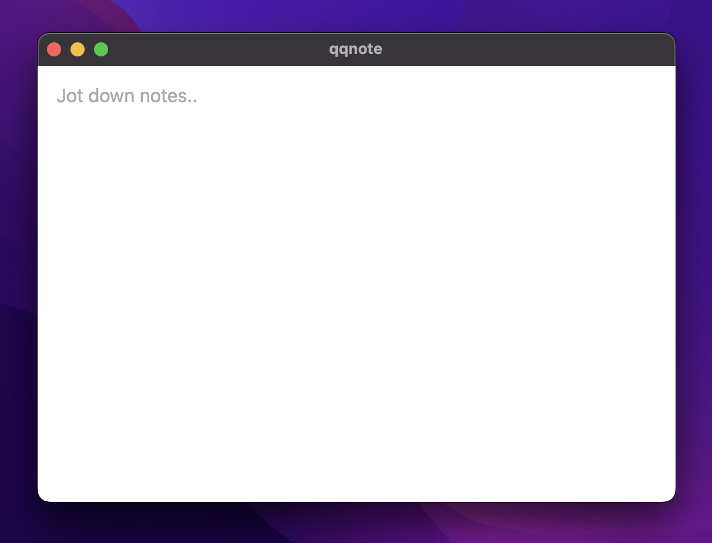

  
  <h1>qqnote</h1>
  
  

    The fastest way to create a note (in the wild west)
  

 

<!-- Screenshots -->

### :camera: Screenshots

 
  

<!-- TechStack -->

### :space_invader: Tech Stack

Uses Tauri, SQLite, Preact, and Typescript

<!-- Features -->

### :dart: Features

- Just a lightweight note taking app

<!-- Getting Started -->

## :toolbox: Getting Started

<!-- Prerequisites -->

### :bangbang: Prerequisites

TBD

<!-- Installation -->

### :gear: Installation

TBD

<!-- Run Locally -->

### :running: Run Locally

TBD

<!-- Deployment -->

### :triangular_flag_on_post: Deployment

TBD

<!-- Usage -->

## :eyes: Usage

TBD
